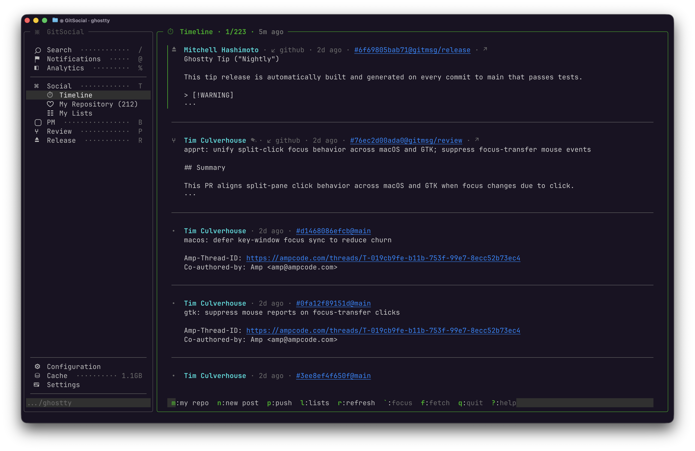

# GitSocial [Beta]

Open source social network protocol for Git repositories.

## Features

- Universal - Turn any Git repository into a social network
- Decentralized - No servers, no databases, no APIs
- Owned - Your data and social graph stay in your repos, fully portable, work offline
- Git-native - Uses only standard Git infrastructure (commits, branches, refs)
- Anywhere - Works on GitHub.com, GitLab.com, self-hosted, or local

---

## How It Works

### Posts are commits

- Commits are posts (typically on a `gitsocial` branch)
- Commits with GitMsg headers are interactions (comments/reposts/quotes)

### Following Repositories

- Organize repositories into lists (e.g., "OSS", "AI")
- Timeline shows posts and replies from the repositories you follow
- Lists are stored as Git refs in your repo

## Quick Start

1. Install: Download VSCode extension (see Installation below)
2. Post: Open GitSocial panel and write a message (commits to your `gitsocial` branch)
3. Follow: Create a list and add repository URLs (lists stored as Git refs)
4. Timeline: View posts from all repositories you follow (fetches commits from your lists)
5. Interact: Comment, repost, or quote posts (creates commits with references)

## Installation

**VS Code Extension:**
- Install from [VS Code Marketplace](https://marketplace.visualstudio.com/items?itemName=gitsocial.gitsocial)
- Or search "GitSocial" in VS Code Extensions panel
- Or download `.vsix` from [GitHub Releases](https://github.com/gitsocial-org/gitsocial/releases)

## Documentation

- [GITSOCIAL.md](documentation/GITSOCIAL.md) - GitSocial specification
- [GITMSG.md](documentation/GITMSG.md) - GitMsg protocol specification
- [CONTRIBUTING.md](documentation/CONTRIBUTING.md) - Developer guide (also: [AGENTS.md](AGENTS.md))
- [Developer documentation](documentation/) - Architecture, patterns, and more

## License

MIT
