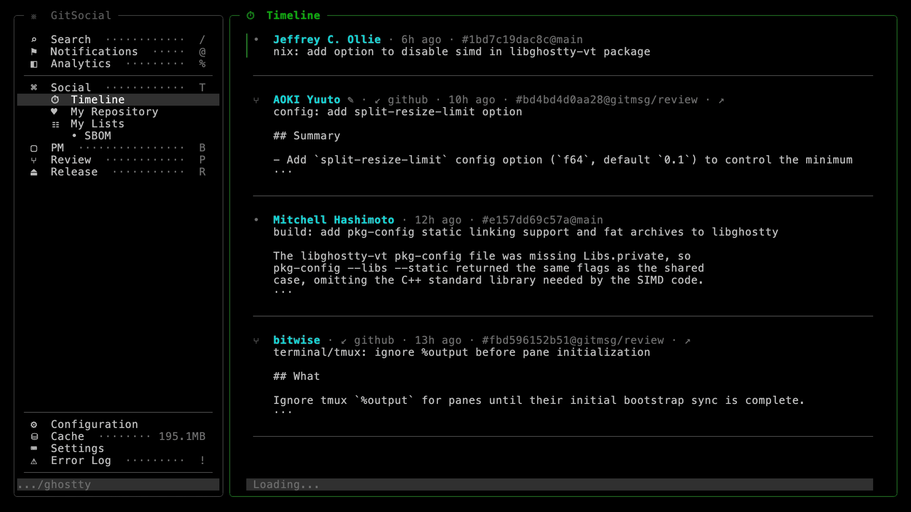

<div align="center">

  
  <h1>GitSocial</h1>

  *Git-native cross-forge collaboration platform*

  [](https://opensource.org/licenses/MIT)
  [](specs/GITMSG.md)
  [](https://github.com/gitsocial-org/gitsocial/actions/workflows/ci.yml)

[Why GitSocial](#why-gitsocial) • [How It Works](#how-it-works) • [Extensions](#extensions--integrations) • [Installation](#installation) • [Quick Start](#quick-start) • [Workflows](#workflows) • [Documentation](#documentation)



</div>

## Why GitSocial

Git solved distributed collaboration for code. GitSocial extends it beyond code, making your data portable and independent.

## How It Works

All collaboration data (posts, issues, PRs, etc.) is stored in your git repository as [git commits with structured trailers](specs/GITMSG.md) on `gitmsg/*` branches, syncing via `git fetch` and `git push`. Activity from other repositories appears in your timeline when you add them to your lists.

## Extensions & Integrations

| Name | Description |
|------|-------------|
| **Social** | Git-native social network: posts, comments, lists, and timelines |
| **PM** | Issues, sprints, and boards (Kanban, Agile, Minimal): portable across hosts, works offline |
| **Review** | [Cross-forge PRs with version tracking](documentation/GITREVIEW-FLOWS.md), rebase-resilient reviews, and inline suggestions |
| **Release** | Releases with artifacts, checksums, signatures, and SBOM: stored in git (LFS) or externally |
| **[Agent Skill](https://github.com/gitsocial-org/gitsocial-agent-skill)** | AI-assisted workflows for Claude Code, Cursor, and other agents: reports, changelogs, triage, and project insights |

## Installation

**Homebrew** (macOS / Linux):
```bash
brew install gitsocial-org/tap/gitsocial
```

If macOS blocks the binary ("cannot verify developer"), run:
```bash
xattr -d com.apple.quarantine $(which gitsocial)
```

**Scoop** (Windows):
```bash
scoop bucket add gitsocial https://github.com/gitsocial-org/scoop-bucket.git
scoop install gitsocial
```

**Shell script** (macOS / Linux):
```bash
curl -fsSL https://raw.githubusercontent.com/gitsocial-org/gitsocial/main/install.sh | sh
```

**Go**:
```bash
go install github.com/gitsocial-org/gitsocial/library/cli@latest
```

Or download a binary from [Releases](https://github.com/gitsocial-org/gitsocial/releases/latest).

## Quick Start

Clone your project from GitHub, GitLab, or any host, then from your project directory:

```bash
gitsocial import         # imports issues, PRs, releases, discussions
gitsocial tui            # explore in the terminal
```

## Workflows

### Follow a project

From your project directory:

```bash
# Initialize and follow a repository
gitsocial social init
gitsocial social list create reading
gitsocial social list add reading https://github.com/someone/interesting-project

# Fetch and browse their activity
gitsocial fetch
gitsocial social timeline

# Post, comment, and publish
gitsocial social post "Working on dark mode support"
gitsocial social comment <post-id> "Great approach!"
gitsocial push
```

### Open a cross-forge pull request

Fork on any host. The PR works regardless of where your fork lives.

```bash
git checkout -b feature/my-change         # make changes, commit

gitsocial review pr create \
  --base main \
  --head feature/my-change \
  "Short description of change"

git push origin feature/my-change         # push your branch
gitsocial push                            # push PR metadata
```

See [GitReview Flows](documentation/GITREVIEW-FLOWS.md) for version tracking, merge strategies, and cross-forge scenarios.

## Documentation

| Document | Description |
|----------|-------------|
| [CLI Reference](documentation/CLI.md) | Commands, flags, output formats |
| [GitReview Flows](documentation/GITREVIEW-FLOWS.md) | Cross-forge PR workflows, version tracking, merge strategies |
| [Architecture](documentation/ARCHITECTURE.md) | System design, packages, cache |
| [TUI Layouts](documentation/TUI-DIAGRAMS.md) | ASCII diagrams for every view |
| [JSON-RPC](documentation/RPC.md) | Editor integration over stdio |

## Protocol Specifications

| Spec | Description |
|------|-------------|
| [GITMSG.md](specs/GITMSG.md) | Core message format, headers, refs, versioning |
| [GITSOCIAL.md](specs/GITSOCIAL.md) | Posts, comments, reposts, quotes, lists |
| [GITPM.md](specs/GITPM.md) | Issues, milestones, sprints |
| [GITREVIEW.md](specs/GITREVIEW.md) | Pull requests, inline feedback, review states |
| [GITRELEASE.md](specs/GITRELEASE.md) | Releases, artifacts, checksums, signatures, SBOM |

## Contributing

Platform issues and PRs are disabled on all mirrors. GitSocial uses its own tools for collaboration.

### Getting Started

1. Install GitSocial (see [Installation](#installation))
2. Fork the repository on any host (GitHub, GitLab, Codeberg, or self-hosted)
3. Clone your fork: `git clone https://your-host.com/you/gitsocial`

### Submitting Pull Requests

```bash
git checkout -b feature/my-change         # make changes, commit

gitsocial review pr create \
  --base main \
  --head feature/my-change \
  "Short description of change"

git push origin feature/my-change         # push your branch
gitsocial push                            # push PR metadata
```

After your first push, request fork registration in the [Matrix room](https://matrix.to/#/!uZYlsFjjQgPmSBYJaY:matrix.org?via=matrix.org) so maintainers can discover your PRs and issues.

See [GitReview Flows](documentation/GITREVIEW-FLOWS.md) for the full cross-forge PR workflow.

### Reporting Bugs & Requesting Features

```bash
gitsocial pm issue create "Bug: description"
gitsocial push
```

For quick questions or discussion, use the [Matrix room](https://matrix.to/#/!uZYlsFjjQgPmSBYJaY:matrix.org?via=matrix.org).

## License

MIT
