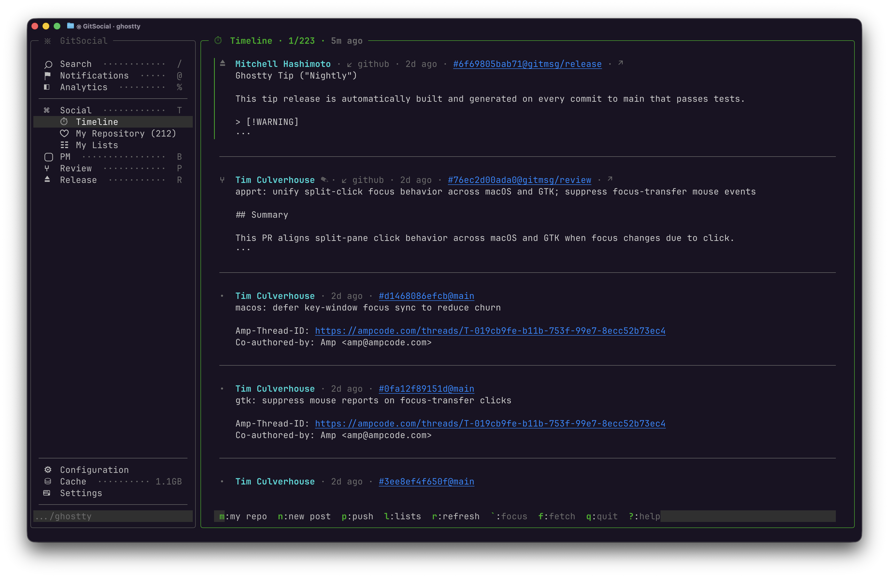

<div align="center">

  
  <h1>GitSocial</h1>

  *Git-native cross-forge collaboration: posts, issues, PRs, releases, all in your repo*

  [](https://opensource.org/licenses/MIT)
  [](specs/GITMSG.md)
  [](https://github.com/gitsocial-org/gitsocial/actions/workflows/ci.yml)

[How It Works](#how-it-works) • [Extensions](#extensions) • [Installation](#installation) • [Quick Start](#quick-start) • [Documentation](#documentation) • [Contributing](#contributing)



</div>

## How It Works

- Everything is a commit: posts, issues, PRs, releases stored on `gitmsg/*` branches
- Syncing is git: `git fetch` to update, `git push` to publish; works offline and peer-to-peer
- Portable: `git clone --mirror`, no export tools needed
- CLI, TUI, and JSON-RPC interfaces

## Extensions

| Extension | Status | Description |
|-----------|--------|-------------|
| **Social** | Stable | Posts, comments, reposts, lists, timeline |
| **PM** | Stable | Issues, milestones, sprints, boards |
| **Review** | Stable | Cross-forge PRs, version-aware reviews ([see more](documentation/GITREVIEW-FLOWS.md)) |
| **Release** | Stable | Releases, artifacts, checksums, signatures, SBOM |

## Installation

**Homebrew** (macOS / Linux):
```bash
brew install gitsocial-org/tap/gitsocial
```

If macOS blocks the binary ("cannot verify developer"), run:
```bash
xattr -d com.apple.quarantine $(which gitsocial)
```

**Scoop** (Windows):
```bash
scoop bucket add gitsocial https://github.com/gitsocial-org/scoop-bucket.git
scoop install gitsocial
```

**Shell script** (macOS / Linux):
```bash
curl -fsSL https://raw.githubusercontent.com/gitsocial-org/gitsocial/main/install.sh | sh
```

**Go**:
```bash
go install github.com/gitsocial-org/gitsocial/library/cli@latest
```

Or download a binary manually from [Releases](https://github.com/gitsocial-org/gitsocial/releases/latest).

## Quick Start

Import an existing project and explore it in the TUI:

```bash
git clone https://github.com/your/repo
cd repo
gitsocial import         # imports issues, PRs, releases, discussions
gitsocial tui
```

### CLI Walkthrough

Start from scratch with the CLI:

```bash
# Initialize GitSocial in your repo
cd repo
gitsocial social init

# Create a list and follow a repository
gitsocial social list create reading
gitsocial social list add reading https://github.com/someone/interesting-project

# Fetch updates and view timeline
gitsocial fetch
gitsocial social timeline

# Write a post
gitsocial social post "First post from GitSocial"

# Publish
gitsocial push
```

## Documentation

**[GitReview Flows](documentation/GITREVIEW-FLOWS.md) - PR workflows and cross-forge scenarios**

### Developer Docs

| Document | Description |
|----------|-------------|
| [Architecture](documentation/ARCHITECTURE.md) | System design, packages, cache, and dependencies |
| [CLI Reference](documentation/CLI.md) | Commands, flags, output formats, and scripting |
| [TUI Diagrams](documentation/TUI-DIAGRAMS.md) | ASCII layouts for every list and detail view |
| [JSON-RPC](documentation/RPC.md) | Client integration over stdio |

### Integrations

| Integration | Description |
|-------------|-------------|
| [Agent Skill](https://github.com/gitsocial-org/gitsocial-agent-skill) | GitSocial for AI agents |

### Protocol Specs

| Spec | Description |
|------|-------------|
| [GITMSG.md](specs/GITMSG.md) | Core message format, headers, refs, and versioning |
| [GITSOCIAL.md](specs/GITSOCIAL.md) | Posts, comments, reposts, quotes, and lists |
| [GITPM.md](specs/GITPM.md) | Issues, milestones, sprints, and hierarchy |
| [GITREVIEW.md](specs/GITREVIEW.md) | Pull requests, inline feedback, and review states |
| [GITRELEASE.md](specs/GITRELEASE.md) | Releases with artifacts, checksums, signatures, and SBOM |

## Contributing

Platform issues and PRs are disabled on all mirrors — GitSocial uses its own tools for collaboration.

### Getting Started

1. Install GitSocial (see [Installation](#installation))
2. Fork the repository on any host (GitHub, GitLab, Codeberg, or self-hosted)
3. Clone your fork: `git clone https://your-host.com/you/gitsocial`

### Submitting Pull Requests

```bash
git checkout -b feature/my-change         # make changes, commit

gitsocial review pr create \
  --base main \
  --head feature/my-change \
  "Short description of change"

git push origin feature/my-change        # push your branch
gitsocial push                           # push PR metadata
```

After your first push, request fork registration in the [Matrix room](https://matrix.to/#/!uZYlsFjjQgPmSBYJaY:matrix.org?via=matrix.org) so maintainers can discover your PRs and issues.

See [GitReview Flows](documentation/GITREVIEW-FLOWS.md) for the full cross-forge PR workflow.

### Reporting Bugs & Requesting Features

```bash
gitsocial pm issue create "Bug: description"
gitsocial push
```

For quick questions or discussion, use the [Matrix room](https://matrix.to/#/!uZYlsFjjQgPmSBYJaY:matrix.org?via=matrix.org).

## License

MIT
